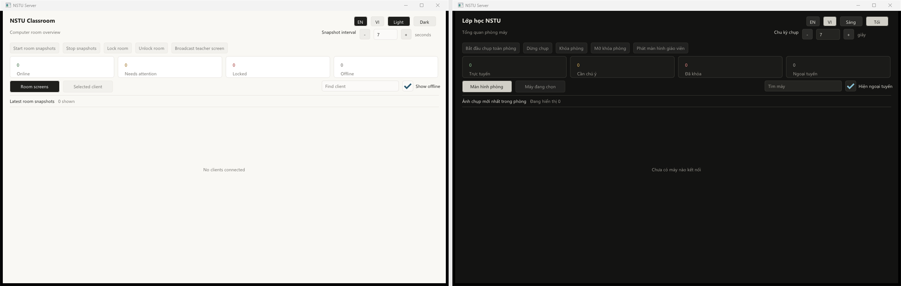

# Project NSTU

[English](README.md) | [Tiếng Việt](README.vi.md) | [Hướng dẫn phát triển](docs/DEVELOPMENT.md)

[](https://github.com/Khoasoma/nstu/actions/workflows/windows.yml)
[](LICENSE)

NSTU là dự án quản lý lớp học và phòng máy Windows miễn phí, mã nguồn mở. Dự
án hướng đến một máy giáo viên quản lý tập trung, client nhẹ trên máy học sinh,
lệnh điều khiển được xác thực, chat, snapshot màn hình tiết kiệm băng thông và
broadcast màn hình giáo viên trong mạng nội bộ.



*Dashboard server: chế độ sáng tiếng Anh và chế độ tối tiếng Việt.*

> **Trạng thái phát triển:** NSTU hiện là engineering MVP, chưa phải bản
> production. Persisted enrollment, dispatcher nhiều client, authenticated
> control routing, JPEG snapshot định kỳ, annotation overlay, teacher-screen
> snapshot broadcast, packetization và device recovery đã có implementation/test;
> continuous H.264 decode end-to-end và validation matrix trên phòng máy thật
> chưa hoàn thành.
> Không nên dùng bản nightly hiện tại như một biện pháp bảo mật trong trường học
> thật.

## Câu chuyện bắt đầu

NSTU bắt nguồn từ sự tiếc nuối khi chứng kiến các trường học phải dựa vào phần
mềm quản lý phòng máy không có bản quyền. Phần mềm đến từ nguồn không tin cậy có
thể bị sửa đổi, bị khai thác, hoặc âm thầm biến máy tính trong phòng học thành
hạ tầng đào tiền mã hóa cho kẻ tấn công. Đồng thời, khi Việt Nam ngày càng siết
chặt vấn đề bản quyền, chi phí phần mềm có thể khiến một số trường có ngân sách
hạn chế khó trang bị và quản lý phòng tin học đúng pháp luật.

Vì vậy, chúng tôi xây dựng NSTU như một lựa chọn thực tế: miễn phí, có thể kiểm
tra mã nguồn, dễ cài đặt, và được thiết kế cho cả an toàn lẫn phần cứng cấu hình
thấp. NSTU dùng MIT License. Trường học, giáo viên, doanh nghiệp và cá nhân có
thể sử dụng, nghiên cứu, sửa đổi và phân phối lại, kể cả cho mục đích thương mại,
miễn là giữ lại thông báo bản quyền và nội dung giấy phép.

Mã nguồn mở không tự động đồng nghĩa với an toàn. Vì vậy NSTU công khai threat
model và các hạng mục production chưa hoàn thành tại
[SECURITY.md](docs/SECURITY.md) và [ROADMAP.md](docs/ROADMAP.md).

## Năng lực hướng đến

- Quản lý từ 50 máy Windows trở lên bằng một máy giáo viên.
- Theo dõi phòng máy bằng JPEG snapshot có giới hạn, chụp mỗi 5-10 giây để
  tránh tải video liên tục trên switch.
- Lock/unlock client, vẽ lên màn hình một máy học sinh bằng click-through
  overlay và broadcast snapshot màn hình giáo viên.
- Giữ nền tảng H.264 multicast/unicast cho chế độ broadcast liên tục tùy chọn
  trong tương lai, không dùng làm đường monitoring mặc định.
- Hiển thị screen wall responsive của các snapshot mới nhất, cùng telemetry,
  điều khiển và chat tập trung cho một máy.
- Chạy Windows Service nhỏ và Win32 tray/chat agent native trên client.
- Xác thực lệnh điều khiển và video mà không cần JSON, XML, Electron hay driver
  kernel tùy biến.
- Giữ secret, dump, capture và runtime state ở local, không đưa lên Git.

## Cấu hình hệ thống

Đây là mục tiêu cấu hình của dự án, chưa phải kết quả đã được xác nhận bằng soak
test trên phòng máy 50 client thật.

| Vai trò | Cấu hình mục tiêu | Mạng |
| --- | --- | --- |
| Server | Intel Core i5-6400, RAM 8 GB, trống 512 MB, Windows 10/11 x64 | Khuyến nghị Gigabit Ethernet có dây |
| Client | Intel Core i5-6400, RAM 8 GB, trống 512 MB, Windows 10/11 x64 | Khuyến nghị Ethernet có dây |
| Router/switch | Hỗ trợ UDP multicast, IGMPv2 hoặc IGMPv3, IGMP snooping và IGMP querier | Một LAN/VLAN được kiểm soát cho lần triển khai đầu |

Với server quản lý từ 50 máy trở lên, RAM 16 GB và SSD là lựa chọn thận trọng
cho đến khi mục tiêu 8 GB vượt qua kiểm thử phần cứng dài hạn. Intel HD Graphics
530 là baseline cho hardware acceleration, không phải cam kết hoạt động với mọi
phiên bản driver.

## Sơ đồ mạng khuyến nghị

```text
Máy giáo viên (NSTU Server)
          |
     Gigabit Ethernet
          |
Managed switch/router có IGMP snooping + một IGMP querier
     |            |             |
 Client 01     Client 02      Client 50+
```

Trước khi triển khai production:

1. Đặt server và client trong cùng VLAN hoặc subnet tin cậy ở lần triển khai
   đầu tiên.
2. Bật IGMP snooping trên managed switch và đảm bảo chỉ một router hoặc switch
   Layer 3 làm IGMP querier cho VLAN đó.
3. Không expose trực tiếp control/video traffic của NSTU ra Internet.
4. Ưu tiên Ethernet có dây. Nếu thử nghiệm bằng Wi-Fi, tắt AP client isolation
   và kiểm tra multicast không bị ép xuống legacy data rate.
5. Không nên dùng unmanaged switch cho phòng máy lớn. Nếu không có IGMP
   snooping, multicast có thể bị flood đến mọi port. Nếu multicast bị chặn,
   fallback unicast dự kiến sẽ làm băng thông server và switch tăng theo từng
   client.
6. Luôn bật Windows Firewall. TCP `47001` là control port mặc định và UDP `47000`
   dành cho video transport. Chỉ mở rule cho VLAN phòng học và executable cần
   thiết; không expose rule rộng ra Internet.

Multicast qua nhiều VLAN cần multicast routing được cấu hình có chủ đích. Không
nên bật tính năng này chỉ để discovery hoạt động.

## Cài bản thử nghiệm hiện tại

Nightly installer được phát hành tại
[trang Releases](https://github.com/Khoasoma/nstu/releases). Đây là artifact
development chưa được ký số nên Microsoft Defender SmartScreen có thể cảnh báo.
Hãy xác minh nguồn release và SHA-256 trước khi chạy:

```powershell
Get-FileHash .\nstu-server-*.exe -Algorithm SHA256
Get-FileHash .\nstu-client-*.exe -Algorithm SHA256
```

### Server

1. Tải `nstu-server-<version>.exe` từ pre-release mới nhất.
2. Chạy installer và chấp nhận UAC nếu Windows yêu cầu.
3. Khởi động:

   ```powershell
   & "$env:ProgramFiles\NSTU\server\nstu-server.exe"
   ```

Dashboard không tự chèn dữ liệu demo. Registry client khởi động ở trạng thái
trống và chỉ hiển thị record do runtime registry cung cấp. Giáo viên có thể
chuyển giữa `Room screens`, hiển thị toàn bộ client phù hợp trong screen wall
responsive, và `Selected client`, tập trung telemetry, điều khiển snapshot,
annotation, lock/unlock và chat cho một máy. Khoảng chụp điều chỉnh từ 5-10
giây. Mỗi JPEG bị giới hạn ở 60 KiB và queue chỉ giữ snapshot mới nhất để tránh
tích tụ frame cũ. Broadcast màn hình giáo viên dùng cùng đường snapshot có giới
hạn. Dashboard có nút chuyển English/Tiếng Việt và chế độ sáng/tối. Khi minimize
hoặc đóng cửa sổ, server tiếp tục chạy trong notification area của Windows; dùng
menu tray để mở lại hoặc thoát. Continuous H.264/UDP preview vẫn là hạng mục tùy
chọn trong tương lai.

Cũng có thể chọn sẵn Tiếng Việt và dark mode khi khởi động:

```powershell
& "$env:ProgramFiles\NSTU\server\nstu-server.exe" --language=vi --dark
```

### Client

1. Tải và chạy `nstu-client-<version>.exe` bằng quyền Administrator.
2. Installer tự đăng ký `nstu-service` để khởi động cùng Windows và cấu hình
   service recovery. Service không được khởi động ngay bên trong phiên cài đặt.
3. Restart Windows khi installer yêu cầu. Ở lần boot tiếp theo, service tự chạy
   và khởi động đúng một instance `nstu-agent.exe` trong user session đang active
   khi đăng nhập hoặc mở khóa.
4. Sau khi restart, Administrator có thể kiểm tra service bằng:

   ```powershell
   Get-Service nstu-service
   ```

Để gỡ client, dùng **Installed apps** của Windows hoặc NSTU uninstaller. Trình
gỡ cài đặt sẽ dừng agent, xóa service, xóa file package và yêu cầu restart thêm
một lần. Gỡ service thủ công không phải quy trình triển khai được hỗ trợ.

## Kết nối một phòng máy

Quy trình enrollment engineering hiện dùng command line. Trên server, chạy
`configure-data-root.ps1` và `new-enrollment-secret.ps1` bằng quyền Administrator,
sau đó restart `nstu-server.exe`. Trên từng client, dùng identity 128-bit riêng:

```powershell
$clientId = [guid]::NewGuid().ToString("N")
& "$env:ProgramFiles\NSTU\client\nstu-provision.exe" `
  192.168.10.10 47001 $clientId 1 "D:\SecureTransfer\nstu-enrollment.bin"
```

Tool xác thực enrollment transcript, derive PSK mà không truyền PSK trên mạng,
và lưu cấu hình client bằng machine-scope DPAPI. Xóa mọi bản copy enrollment
secret sau khi enroll, rồi restart service hoặc Windows.

```text
Cài client
  -> cấp danh tính riêng và enrollment credential được bảo vệ
  -> xác thực với server qua TCP
  -> đăng ký thiết bị và nhận room policy
  -> nhận cấu hình video group đã được xác thực
  -> join multicast, đo packet loss và fallback unicast có giới hạn khi cần
```

Connection preamble chỉ giúp loại nhanh peer sai rõ ràng. Danh tính máy chỉ
được chấp nhận sau khi cryptographic handshake thành công. Enrollment UI cho
giáo viên và workflow multicast/group-key cuối cùng vẫn là release work.

## Triển khai cùng Deep Freeze

- Cài binary vào vị trí Windows được bảo vệ thông thường.
- Dành riêng một thawed location có ACL chặt cho identity đã enroll, key material
  được bảo vệ, cấu hình, audit log và update state.
- Cấu hình vị trí đó trước enrollment bằng `configure-data-root.ps1 -DataRoot
  "D:\NSTUData"`.
- Tuyệt đối không đưa PSK, certificate, dump, screen capture hay runtime secret
  vào repository.
- Không đóng băng image production trước khi đã kiểm thử persistence của
  enrollment, service recovery, upgrade và rollback.
- Boot máy ở trạng thái Thawed và tắt bảo vệ Deep Freeze trước khi cài, nâng cấp
  hoặc gỡ NSTU. Client uninstaller kiểm tra các service `DFServ`/`DeepFrz` đã
  biết và dừng thao tác khi bảo vệ vẫn active; cần xác minh cơ chế kiểm tra thận
  trọng này với đúng edition Deep Freeze được trường sử dụng.

Named pipe và memory-mapped file chỉ giảm I/O tạm thời, không thay thế persistent
protected storage. Deep Freeze sẽ hủy mọi state nằm ngoài thawed space sau reboot.

## Lưu ý bảo mật

- Control session hiện tại dùng mutual HMAC authentication và replay protection.
- JPEG snapshot và video datagram được xác thực, nhưng nội dung màn hình chưa
  được mã hóa. Không thử nghiệm màn hình nhạy cảm trên LAN không tin cậy.
- Automation Authenticode đã có, nhưng artifact nightly vẫn chưa ký; production
  release phải chạy workflow với certificate thật.
- Review/fuzz độc lập, validation từng edition Deep Freeze, ký bằng certificate
  thật và hardware/network matrix vẫn là production blocker.
- CI xanh chỉ chứng minh build và automated test đạt, không chứng minh an toàn
  hoặc độ bền trên phần cứng trường học thật.

## Đóng góp và phát triển

Hướng dẫn build, cấu trúc repository, tùy chọn CMake, test và quy trình fork/PR
nằm trong [development guide](docs/DEVELOPMENT.md). Dependency mới phải tương
thích license permissive; dự án không chấp nhận GPL dependency.

## Người đóng góp

- **Bùi Hồng Hải Đăng (`yanij`)**: đóng góp ý tưởng, hỗ trợ thiết bị test và
  tham gia xây dựng Project NSTU.

## Bản quyền

Project NSTU được phát hành theo [MIT License](LICENSE). Bạn có thể sử dụng, sao
chép, sửa đổi, công bố, phân phối, cấp phép lại và bán bản sao nếu tuân thủ yêu
cầu giữ thông báo license. Thông báo dependency nằm tại
[THIRD_PARTY_NOTICES.md](THIRD_PARTY_NOTICES.md).
